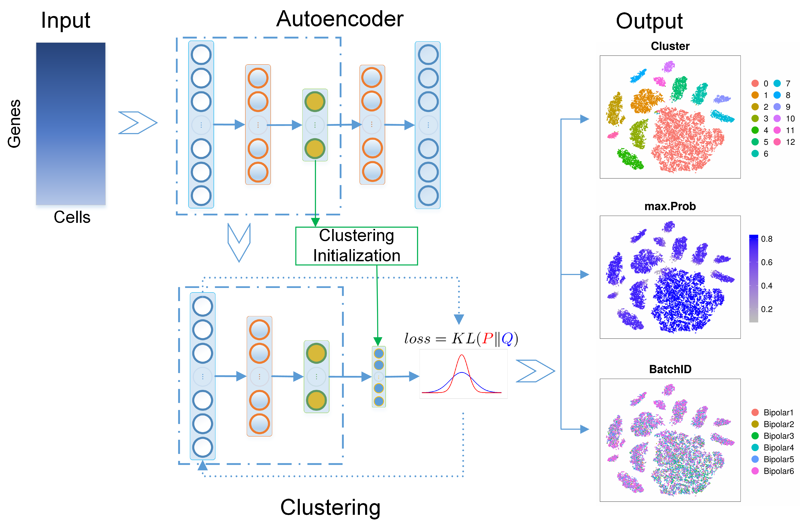

## Deep Embedding for Single-cell Clustering (DESC)

DESC is an unsupervised deep learning algorithm for clustering scRNA-seq data. The algorithm constructs a non-linear mapping function from the original scRNA-seq data space to a low-dimensional feature space by iteratively learning cluster-specific gene expression representation and cluster assignment based on a deep neural network. This iterative procedure moves each cell to its nearest cluster, balances biological and technical differences between clusters, and reduces the influence of the batch effect. DESC also enables soft clustering by assigning a cluster-specific probability to each cell, which facilitates the identification of cells clustered with high-confidence and interpretation of results. 



For thorough details, see the preprint: [Bioxiv](https://www.biorxiv.org)
<br>

## Usage

The [**desc**](https://github.com/eleozzr/desc) package is an implementation of deep embedding for single-cell clustering. With desc, you can:

- Preprocess single cell gene expression data from various formats.
- Build a low-dimensional representation of the single-cell gene expression data.
- Obtain soft-clustering assignments of cells.
- Visualize the cell clustering results and gene expression patterns.
<br>

# Installation
To install  `desc` package you must make sure that your python version is one of `python3.5.x`, `python3.6.x`. If you don’t know the version of python you can check it by 

```python
>>>import platform
>>>platform.python_version()
#3.5.3
```
Now you can install the current release of `desc` by the following three ways.

* PyPI  
Directly install the package from PyPI:

```bash
$ pip install desc
```
Note: you need make sure that the `pip` is for python3，or we should install desc by:
```bash 
python3 -m pip install desc 
#or
pip3 install desc
```

If you do not have sudo rights (when you get a permission denied error): 

```bash
$ pip install --user desc
```

* Github  
Download the package from [Github](https://github.com/eleozzr/desc) and install it locally:

```bash
git clone https://github.com/eleozzr/desc
cd desc
pip install .
```

* Anaconda

If you do not have Python3.5 or Python3.6 installed, consider installing Anaconda (see [Installing Anaconda](https://docs.anaconda.com/anaconda/install/)). After installing Anaconda, you can create a new environment, for example, `DESC` (*you can change to any name you like*):

```bash
conda create -n DESC python=3.5.3
# activate your environment 
source activate DESC 
git clone https://github.com/eleozzr/desc
cd desc
python setup.py build
python setup.py install
# now you can check whether `desc` installed successfully!
```

Please check desc [Tutorial](https://eleozzr.github.io/desc/tutorial.html) for more details.

<br>

## Contributing

Souce code: [Github](https://github.com/eleozzr/desc)  

We are continuing adding new features. Bug reports or feature requests are welcome ([mingyao.lab@gmail.com](mailto:mingyao.lab@gmail.com)).

<br>

## References

Please consider citing the following reference:

- Xiangjie Li, Yafei Lyu, Jihwan Park, Jingxiao Zhang, Dwight Stambolian, Katalin Susztak, Gang Hu, Mingyao Li. Deep learning enables accurate clustering and batch effect removal in single-cell RNA-seq analysis (2019) [https://www.biorxiv.org](https://www.biorxiv.org)
<br>

## Licence

Copyright (C) 2019 Mingyao's Lab